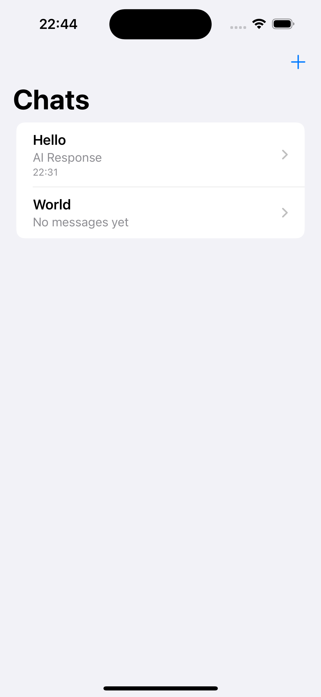
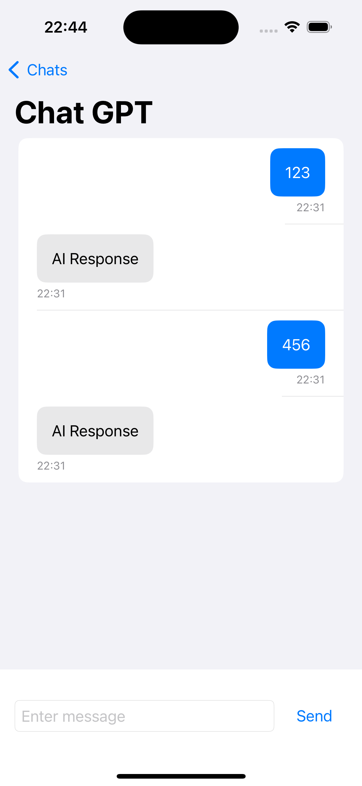
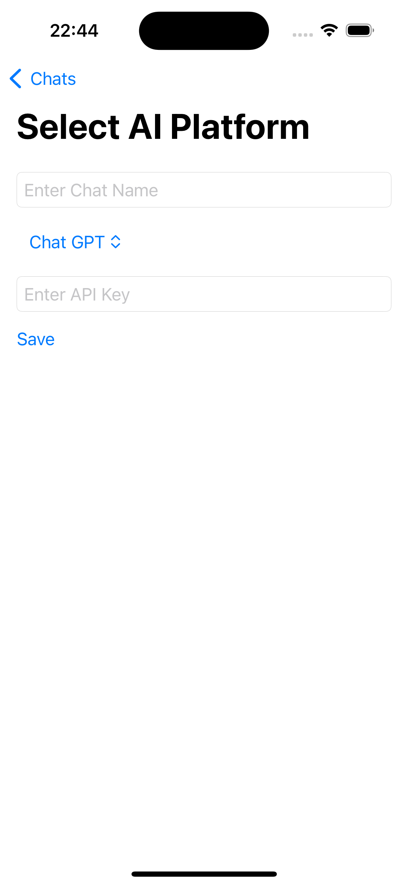

# AIChat-iOS

AIChat-iOS 是一个用于学习 Swift 和 SwiftUI 的示例项目。它提供了一个简单、无依赖的模板，用于构建 AIGC 聊天工具，既适合学习也适合实际应用。

AIChat-iOS is a demo project I created for learning Swift and SwiftUI. With the recent popularity of AIGC and LLMs, people have become accustomed to delegating search and query tasks to AI. To facilitate access to various large models from different platforms and obtain information from these models in a chat-like manner, I developed this unfinished app. It serves as a learning tool and a template for further development, with the aim of continuing to improve it for real-world use.

You can also use AIChat-iOS as a template for starting development on an AIGC large model chat tool. It is a very simple, dependency-free, and beginner-friendly project. I believe that even developers who are new to iOS development can quickly get up to speed and integrate large models to achieve their desired results.

 Chat List | Chat | Add Platform 
------|------|-----
|  | 

## Features

- A list view of chat
- User can add new chat at top right with "+" button
- A simple chat view

## Contributing

We welcome contributions to AIChat-iOS! Here are some ways you can contribute:

1. Implement AIGC Data manager, to make real connections to ChatGPT, Gemini and other LLM platform
2. Build a beautiful UI

## License

AIChat-iOS is available under the MIT license. See the LICENSE file for more info.

